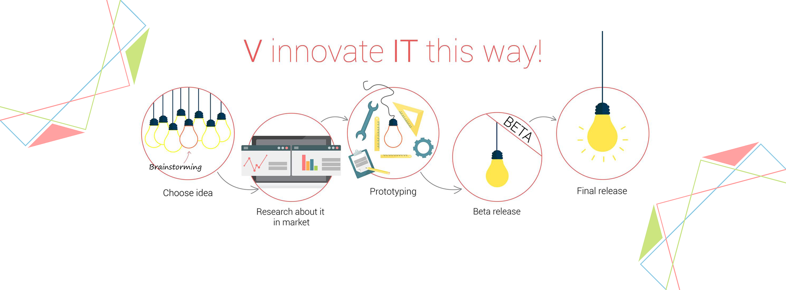

# [VinnovateIT](https://www.facebook.com/VinnovateIT/) - Recruitment Portal


### An online recruitment portal developed for recruitments of [VinnovateIT](https://vinnovateit.com/).

[](https://vinitshahdeo.github.io/Recruitment-Portal/) [](https://vinitshahdeo.github.io/Recruitment-Portal/) [](https://github.com/vinitshahdeo/Recruitment-Portal/blob/master/LICENSE)


```
__     ___                             _       ___ _____ 
\ \   / (_)_ __  _ __   _____   ____ _| |_ ___|_ _|_   _|
 \ \ / /| | '_ \| '_ \ / _ \ \ / / _` | __/ _ \| |  | |  
  \ V / | | | | | | | | (_) \ V / (_| | ||  __/| |  | |  
   \_/  |_|_| |_|_| |_|\___/ \_/ \__,_|\__\___|___| |_|  
                                                         
```

[VinnovateIT](https://www.facebook.com/VinnovateIT/) is an OFFICIAL innovation and incubation lab of SITE School.
VinnovateIT help the members to develop their projects both technically as well as budding entrepreneurs. It is a platform for the students to come up with innovative ideas where one can work on their areas of interest. It also provides an atmosphere of collaborative learning in those areas.


> Stay connected with VinnovateIT's [Facebook](https://www.facebook.com/VinnovateIT/) page.


## Technology Stack Used

 


 
 

- Front End - **HTML**, **CSS**, **JavaScript**
- Framewrok - **[Bootstrap](https://getbootstrap.com/)**
- Back End - **PHP**
- Database - **MySql**

## Requirements

[](https://vinitshahdeo.github.io/Recruitment-Portal/)

The source code of this project is written in **PHP**. So, you'll require **WAMP/XAMPP/MAMP** to run this project.

## Installing 

[](http://www.wampserver.com/en/) [](https://www.apachefriends.org/download.html) [](https://www.mamp.info/en/)

- Download [WAMP](http://www.wampserver.com/en/)
- Download [XAMPP](https://www.apachefriends.org/download.html)
- Download [MAMP](https://www.mamp.info/en/)

## How to run?

1. Download [this](https://github.com/vinitshahdeo/Recruitment-Portal/) repo and extract it in your **www/htdocs** directory. 

2. Import the [database] i.e. `vinnovate.sql` from **db** folder.

3. Configure `dbConnection.php` 

4. Run **`localhost/{YOUR FOLDER NAME}`**

> Check UI screenshots inside `screenshots` folder.

## Need help?

```javascript

  if (needHelp === true) {
     var emailId = "vinitshahdeo@gmail.com";
     // email is the best way to reach out to me.
     sendEmail(emailId);
  }

```

Feel free to contact me via [Facebook](https://www.facebook.com/vinit.shahdeo).

Invite me to connect on [LinkedIn](https://www.linkedin.com/in/vinitshahdeo/).

[](https://www.facebook.com/vinit.shahdeo)  [](https://www.instagram.com/vinitshahdeo/) [](https://www.linkedin.com/in/vinitshahdeo/)


## License

**MIT &copy; [Vinit Shahdeo](https://github.com/vinitshahdeo/Recruitment-Portal/blob/master/LICENSE)**

[](https://github.com/vinitshahdeo/Recruitment-Portal/blob/master/LICENSE) [](https://github.com/vinitshahdeo)

## Author

|                                                                                         <a href="https://www.eatmy.news/2020/06/code-like-you-eat-i-mean-code-daily-as.html"></a>                                                                                         |
| :------------------------------------------------------------------------------------------------------------------------------------------------------------------------------------------------------------------------------------------------------------------------------------------------------------------------------------------: |
|                                                                                                                                        **[Vinit Shahdeo](https://fayz.in/stories/s/1522/0/?ckt_id=ZGL1ZGVk&title=story_of_vinit_shahdeo)**                                                                                                                                        |
| <a href="https://twitter.com/Vinit_Shahdeo"></a> <a href="https://www.facebook.com/vinit.shahdeo"></a> <a href="https://www.linkedin.com/in/vinitshahdeo/"></a> |


## Oh, Thanks!

```bash


 _____ _                 _     __   __            
|_   _| |               | |    \ \ / /            
  | | | |__   __ _ _ __ | | __  \ V /___  _   _   
  | | | '_ \ / _` | '_ \| |/ /   \ // _ \| | | |  
  | | | | | | (_| | | | |   <    | | (_) | |_| |  
  \_/ |_| |_|\__,_|_| |_|_|\_\   \_/\___/ \__,_|  
                                                  
                                                  
______                                            
|  ___|                                           
| |_ ___  _ __                                    
|  _/ _ \| '__|                                   
| || (_) | |                                      
\_| \___/|_|                                      
                                                  
                                                  
______      _               _   _               _ 
| ___ \    (_)             | | | |             | |
| |_/ / ___ _ _ __   __ _  | |_| | ___ _ __ ___| |
| ___ \/ _ \ | '_ \ / _` | |  _  |/ _ \ '__/ _ \ |
| |_/ /  __/ | | | | (_| | | | | |  __/ | |  __/_|
\____/ \___|_|_| |_|\__, | \_| |_/\___|_|  \___(_)
                     __/ |                        
                    |___/                         

 


```

***Glad to see you here! Show some love by [starring](https://github.com/vinitshahdeo/Recruitment-Portal/) this repo.***

[](https://twitter.com/intent/tweet?text=Recruitment%20Portal%20by@Vinit_Shahdeo%20:&url=https://github.com/vinitshahdeo/Recruitment-Portal) [](https://www.github.com/vinitshahdeo)

-----

```javascript

  if (isAwesome) {
    // thanks in advance :p
    starThisRepository();
  }

```

******
